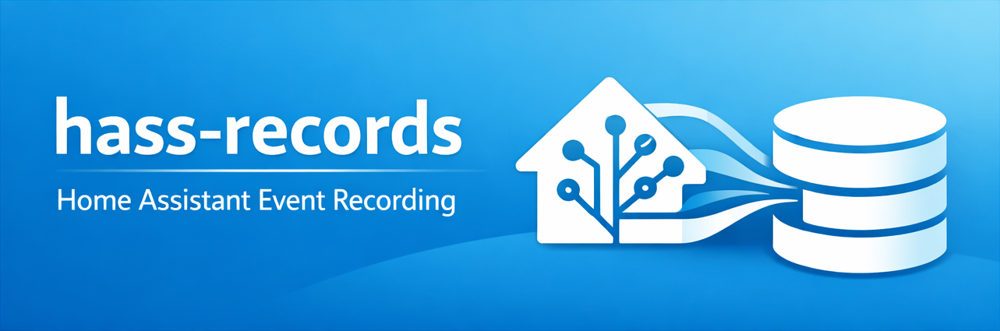
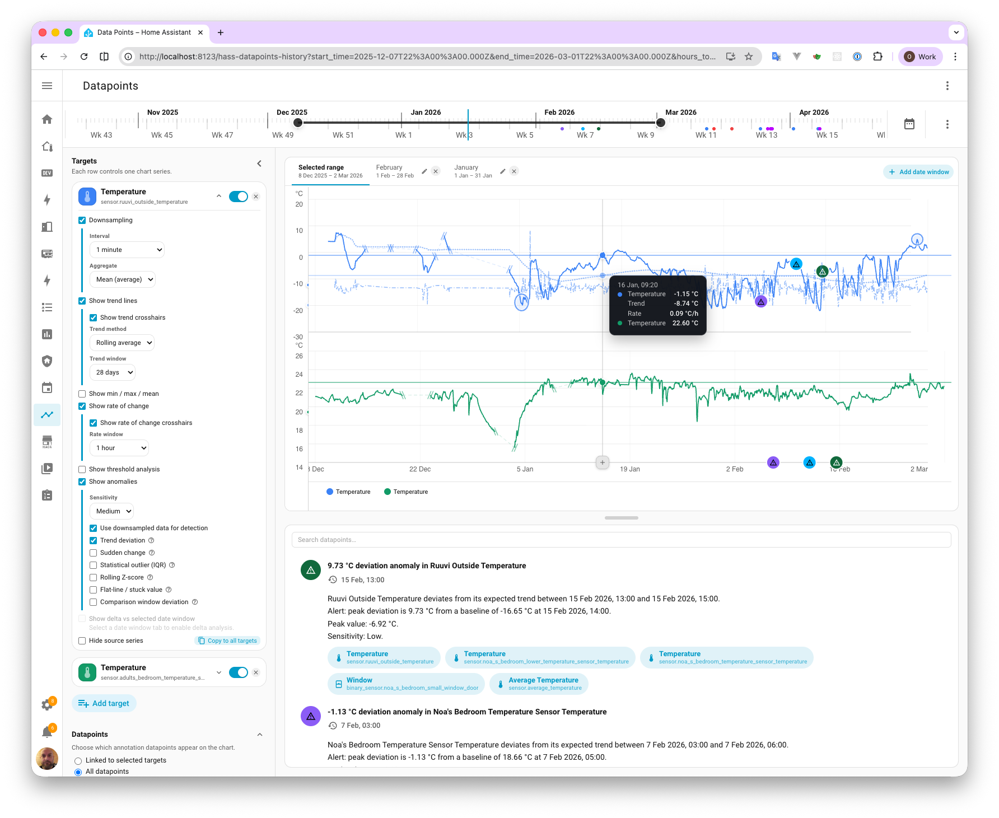
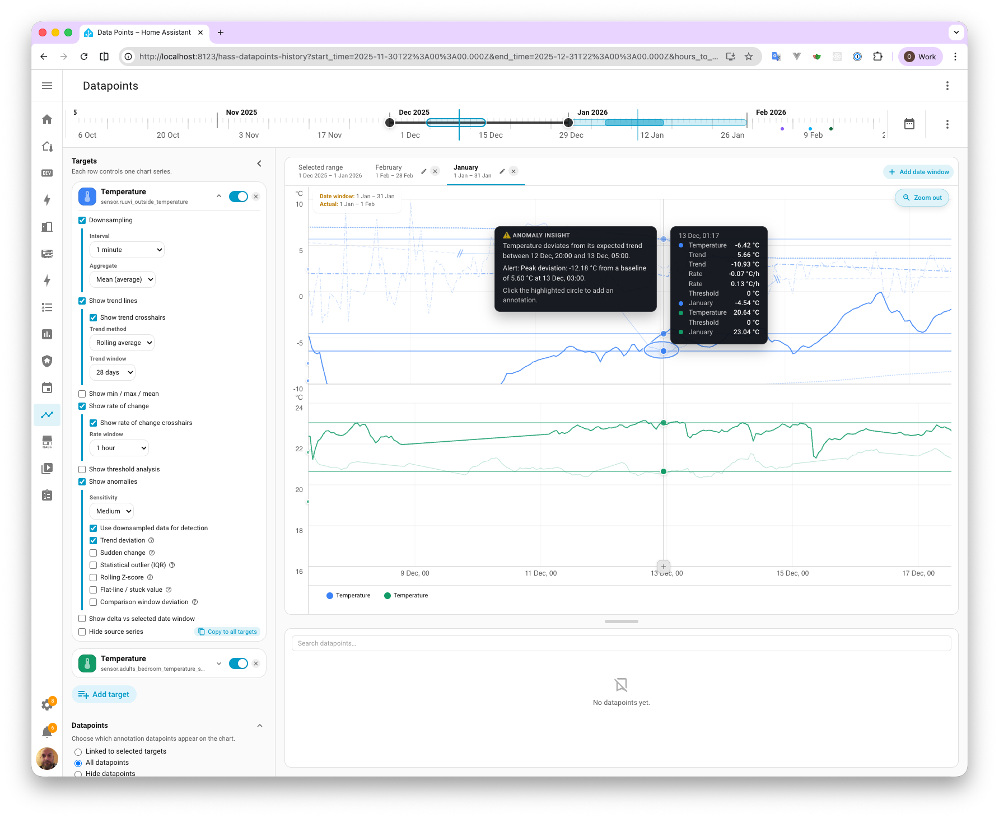
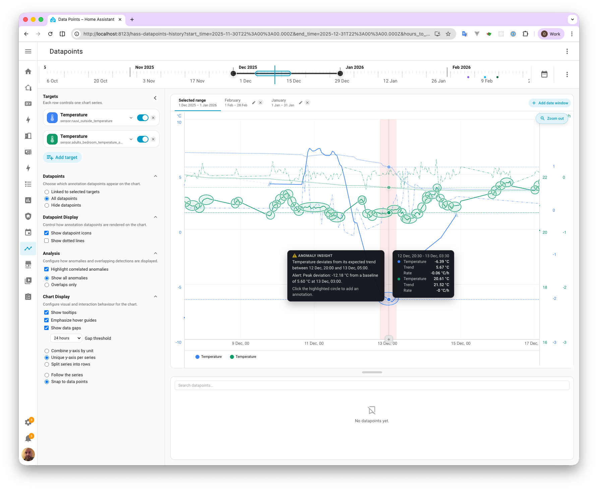

<h1 align="center">Data Points</h1>

<p align="center">
  Record meaningful events in Home Assistant and analyze them directly alongside your entity history, long-term statistics, and chart annotations.
</p>

<p align="center">
  <a href="https://github.com/home-assistant/home-assistant.io"></a>
  <a href="https://hacs.xyz"></a>
  <a href="https://main--69cd024f27ae313c14343a9a.chromatic.com"></a>
  
  
</p>





---

## Table of Contents

- [Overview](#overview)
- [Why Data Points is useful](#why-data-points-is-useful)
- [What Data Points provides](#what-data-points-provides)
- [Included UI](#included-ui)
- [Translations](#translations)
- [Roadmap](#roadmap)
- [Installation](#installation)
- [Setup](#setup)
- [Recording datapoints](#recording-datapoints)
- [How datapoints appear](#how-datapoints-appear)
- [Cards in practice](#cards-in-practice)
- [History chart and page features](#history-chart-and-page-features)
- [Anomaly detection](#anomaly-detection)
- [Using automations to create useful analytical datapoints](#using-automations-to-create-useful-analytical-datapoints)
- [WebSocket API](#websocket-api)
- [Development](#development)
- [Release and CI notes](#release-and-ci-notes)

---

## Overview

Data Points is a Home Assistant integration for recording timestamped events and then using them as analytical context across charts, lists, and a dedicated history page.

It helps you answer questions like:

- What changed?
- When did it change?
- What system or entity was affected?
- Was the change expected?
- Does the related sensor behavior now look suspicious?

The integration bundles its Lovelace cards and panel frontend automatically. No separate Lovelace resource configuration is required.

---

## Why Data Points is useful

A plain chart tells you what changed.

Data Points helps you understand why it changed by combining:

- raw measurements
- long-term statistics
- user-created or automation-created annotations
- target-aware chart overlays
- anomaly detection
- historical date-window comparison

That makes it much easier to investigate:

- heating behavior
- energy usage
- sensor faults
- maintenance effects
- occupancy-driven changes
- environmental anomalies
- operational regressions over time

---

## What Data Points provides

Data Points lets you:

- record custom datapoints from automations, scripts, dashboards, and Developer Tools
- attach datapoints to entities, devices, areas, or labels
- render datapoints directly on history, statistics, and sensor charts
- browse, search, edit, delete, and hide datapoints in a dedicated list card
- investigate entity history with target rows, target-specific options, and date-window comparisons
- create chart annotations directly from the chart while you are exploring data
- use backend-powered anomaly detection to highlight suspicious behavior in data series
- compare a current period against saved historical windows to find drift and regressions

---

## Included UI

### Cards

| Card                            | Purpose                                                                                                                            |
| ------------------------------- | ---------------------------------------------------------------------------------------------------------------------------------- |
| `hass-datapoints-action-card`   | Full recording form with message, annotation, icon, color, and related items.                                                      |
| `hass-datapoints-quick-card`    | Lightweight card for quick operational notes.                                                                                      |
| `hass-datapoints-list-card`     | Searchable, editable, hide/show capable datapoint list.                                                                            |
| `hass-datapoints-dev-tool-card` | Generate useful development datapoints from HA history and clean up development datapoints.                                        |
| `hass-datapoints-history-card`  | Multi-series analysis chart with target rows, anomaly overlays, date windows, zoom, timeline slider, and chart-created datapoints. |
| `hass-datapoints-sensor-card`   | Sensor-focused chart with inline datapoint markers.                                                                                |

All bundled cards now include Lovelace visual editors. The dev-tool editor is intentionally minimal because the card itself does not expose configurable options.

The visual editor surface is complete across the bundled cards, so the typical setup flow is now:

1. Add the card in Lovelace.
2. Configure it entirely through the visual editor.
3. Drop into YAML only if you prefer hand-tuned configuration.

### Dedicated history page / panel

The integration also provides a full history page experience with:

- target rows for each visible series
- per-target analysis controls
- collapsible options sidebar
- collapsed target rail with add-target and preferences controls
- date-window tab bar above the chart
- timeline slider with zoom highlight synchronization
- resizable chart/list split panes
- chart-created datapoints and hover-driven comparison preview

---

## Translations

Data Points ships with both Home Assistant integration translations and frontend card/panel translations.

### Included locales

- English
- Finnish
- French 🤖
- German 🤖
- Spanish 🤖
- Portuguese 🤖
- Simplified Chinese 🤖

### Translation quality

English is the source language for the project. Finnish translations were written by a native speaker.

The other bundled non-English locales are currently machine 🤖 translated. They are included so the UI is immediately usable in more Home Assistant setups without forcing everyone back to English, but they should still be treated as sensible defaults rather than fully reviewed product translations.

If you spot awkward wording in any locale, translation improvements are very welcome.

### Where translations live

- Home Assistant integration/service strings live in:
  `custom_components/hass_datapoints/translations/*.json`
- Frontend component/card/panel strings live next to each surface in local `i18n/` directories under `custom_components/hass_datapoints/src/**/i18n/`

---

## Roadmap

The current integration already covers recording, browsing, chart overlays, comparison windows, and anomaly analysis. The next planned areas build on those foundations rather than replacing them.

### Planned next features

- **Multiple saved views / save files**
  Persist more than one named chart-and-panel state so users can keep reusable investigation setups for different entities, labels, areas, and analysis workflows.

- **Automatic historical period matching**
  Find similar historical periods automatically for selected targets so the panel can suggest or create date windows without requiring manual range hunting.

- **Chart-driven anomaly automation creation**
  Turn chart analysis settings into Home Assistant automations so anomaly recognition can move from exploratory analysis into live monitoring.

- **Automatic anomaly-to-datapoint generation**
  Generate datapoints automatically when configured anomaly conditions are met, making anomalies first-class timeline events that can be reviewed, filtered, and linked back to entities.

- **Backfilling tools for datapoint generation**
  Add tools for creating datapoints from recent history and long-term statistics so important historical changes can be reconstructed after the fact.

- **Anomalies summary card**
  Provide a dedicated card for highlighting current or recent anomalies and deep-linking directly into the full datapoints history view for investigation.

- **Drop-in replacements for HA sensor and statistics cards**
  Continue polishing the lightweight chart-card story so users can replace common Home Assistant sensor/statistics cards with equivalents that support datapoint overlays, deep linking, and richer contextual controls by default.

### Roadmap themes

- **Operational memory**
  Make saved investigative contexts and reconstructed historical events easier to preserve and reuse.

- **Assisted comparison**
  Reduce the manual work needed to find meaningful historical baselines for the current chart range.

- **From analysis to action**
  Let anomaly configuration graduate into automations, alerts, and auto-generated datapoints.

- **Dashboard-native investigation**
  Bring anomaly surfacing and datapoint-aware charting into smaller cards that work well in everyday dashboards.

---

## Installation

### HACS

1. Open HACS.
2. Go to **Integrations**.
3. Add this repository as a custom repository with category **Integration**.
4. Install **Data Points**.
5. Restart Home Assistant.

### Manual

Copy `custom_components/hass_datapoints` into:

```text
config/custom_components/hass_datapoints
```

Then restart Home Assistant.

---

## Setup

Add the integration from:

**Settings -> Devices & Services -> Add Integration -> Data Points**

No YAML setup is required.

---

## Recording datapoints

Use the `hass_datapoints.record` action from:

- automations
- scripts
- dashboards
- Developer Tools -> Actions

### Action fields

| Field        | Required | Description                                                                            |
| ------------ | -------- | -------------------------------------------------------------------------------------- |
| `message`    | Yes      | Short label shown in lists, chips, chart tooltips, and the logbook.                    |
| `annotation` | No       | Longer note or context. Defaults to the message when omitted.                          |
| `entity_ids` | No       | Entities related to the datapoint. These are the most useful links for chart analysis. |
| `icon`       | No       | MDI icon used for the datapoint marker and related UI.                                 |
| `color`      | No       | Marker color. Accepts a hex string or an RGB list.                                     |

### Minimal example

```yaml
action: hass_datapoints.record
data:
  message: "Something happened"
```

### Full example

```yaml
action: hass_datapoints.record
data:
  message: "Heating schedule changed"
  annotation: >-
    Switched the house to the weekday daytime profile after school pickup.
    This was done manually because the normal automation was paused.
  entity_ids:
    - climate.living_room
    - sensor.living_room_temperature
  icon: mdi:radiator
  color: "#ff5722"
```

### RGB color example

```yaml
action: hass_datapoints.record
data:
  message: "Critical alert"
  color:
    - 255
    - 0
    - 0
```

---

## How datapoints appear

When a datapoint is recorded:

1. It is stored in `.storage/hass_datapoints.events`.
2. It is emitted on the HA event bus as `hass_datapoints_event_recorded`.
3. It appears in the Home Assistant logbook.
4. It becomes available to the cards and history page.

### Chart placement behavior

On history and statistics charts, datapoints are placed:

- on the related visible series when linked to a visible target
- on the chart baseline when linked to something not currently charted
- on a fallback position when they are global and have no explicit series link

On the sensor card, datapoints are drawn directly on the sensor series.

---

## Cards in practice

> **Card editors are in development.** The cards are functional but still have certain layout and styling issues. Most functionality is fine but there are still some rough edges.

### Action card

Use this when you want a complete form for recording rich operational notes.

```yaml
type: custom:hass-datapoints-action-card
title: Record event
```

### Quick card

Use this for lightweight logging such as:

- maintenance notes
- household observations
- manual interventions
- quick analytical breadcrumbs

```yaml
type: custom:hass-datapoints-quick-card
title: Quick note
icon: mdi:bookmark
color: "#ff9800"
```

### List card

Use this to browse, search, and hide datapoints. Admin users also see edit and delete buttons for each record.

```yaml
type: custom:hass-datapoints-list-card
title: All datapoints
page_size: 20
```

### Sensor card

Use this for a single entity with inline datapoint markers.

```yaml
type: custom:hass-datapoints-sensor-card
entity: sensor.living_room_temperature
hours_to_show: 24
```

### History card

Use this for multi-series exploration, date-window comparison, anomaly review, and chart-driven datapoint creation.

```yaml
type: custom:hass-datapoints-history-card
title: Room temperatures
entities:
  - sensor.living_room_temperature
  - sensor.bedroom_temperature
hours_to_show: 72
```

### Statistics card

Use this when the entity is best viewed through long-term statistics.

```yaml
type: custom:hass-datapoints-statistics-card
title: Daily energy
entity: sensor.daily_energy
hours_to_show: 168
period: hour
stat_types:
  - mean
```

### Dev tool card

Use this for seeding and cleanup workflows:

- generate development datapoints from HA history
- create repeatable analytical markers for testing
- bulk delete development datapoints

---

## History chart and page features

The history surfaces are the most powerful part of the integration.

### Target rows

Each target row controls one visible chart series and supports:

- visibility on or off
- color selection
- drag-to-reorder
- analysis expansion
- chart participation for datapoints and anomaly overlays

When a target is hidden, it can be restored from the same row without losing its configuration.

### Datapoint visibility modes

The history chart can show:

- datapoints linked to selected targets
- all datapoints
- no datapoints

### Chart display options

The history chart and page support:

- tooltips
- emphasized hover guides
- correlated anomaly highlighting
- data-gap rendering
- shared vs split y-axis
- split series into rows
- hover mode: follow the series vs snap to datapoints

### Date windows

Date windows let you save named historical periods and then:

- preview them from tabs above the chart
- compare the current period against a known baseline
- investigate seasonal or maintenance-driven changes
- support comparison-based anomaly detection

Useful date windows include:

- `Last week`
- `Before maintenance`
- `Heating baseline`
- `After insulation`
- `Last cold snap`

### Zoom and timeline controls

The history chart supports:

- drag-to-zoom directly on the chart
- a timeline slider for the full available range
- zoom highlight synchronization between chart and timeline
- zoom-out control
- timeline drag handles for precise range control

### Create datapoints from the chart

The chart `+` action can create a datapoint at the inspected time. The dialog can prefill related items from the currently visible target rows so that the note is immediately linked to the right series.

---

## Anomaly detection

Anomaly detection is designed to help you spot suspicious patterns in time series without having to inspect every line manually.

The anomaly results are provided by the backend and rendered in the frontend chart and panel UI.

### What anomaly detection helps you find

Use anomaly detection to spot:

- stuck or flat-lined sensors
- sudden spikes and drops
- values drifting away from their normal trend
- unusual rate-of-change behavior
- differences between the current period and a known-good date window
- suspicious clusters of events or repeated abnormal periods

### Available anomaly methods

Depending on the target and configuration, anomaly analysis supports methods such as:

- trend deviation
- rate of change
- IQR / statistical outlier detection
- rolling Z-score
- persistence / flat-line detection
- comparison-window anomalies

### How to use anomaly detection

1. Open the history page or history card.
2. Add one or more target entities.
3. Expand a target row's analysis options.
4. Enable **Show anomalies** for that target.
5. Choose one or more anomaly methods.
6. Tune sensitivity and method-specific windows.
7. Hover highlighted regions and compare them with datapoints and related context.

### A practical anomaly workflow

For a single series:

1. Start with one visible target.
2. Enable `trend deviation` or `rolling Z-score` first.
3. Add `persistence` if you suspect the sensor stopped updating.
4. Use `rate of change` for abrupt transitions such as open windows or sudden heating.
5. Add a date window from a known-good period if you want to compare behavior against a baseline.
6. If multiple targets are visible, switch to split rows to reduce visual density.

### Example use cases

#### Detect a stuck sensor

Use:

- persistence
- medium or high sensitivity
- a window that matches the expected update cadence

This is useful for:

- room temperature sensors
- humidity sensors
- power sensors that silently stop updating

#### Investigate abnormal heating behavior

Use:

- comparison window
- a date window from a normal day or week
- threshold and trend analysis alongside anomalies

This is useful for:

- rooms that heat too slowly
- delayed radiator response
- unexplained overnight heating

#### Find unusual environmental spikes

Use:

- rolling Z-score
- rate of change

This is useful for:

- windows opening
- hot water usage spikes
- unexpected ventilation events
- sensor glitches

### Reading anomaly output effectively

Anomaly markers are most useful when paired with datapoints that explain likely causes.

For example:

- `Boiler serviced`
- `Window left open`
- `Heating mode changed`
- `Fan speed manually increased`
- `Dehumidifier moved`

The ideal workflow is:

1. let anomaly detection tell you where to look
2. use datapoints to record likely causes
3. compare against date windows to see whether the anomaly is new or expected

That turns anomalies from a visual warning into an actionable investigative tool.

---

## Using automations to create useful analytical datapoints

Datapoints are most valuable when they explain future chart behavior.

The best automations record changes in state, intent, or operating mode rather than just mirroring every raw metric update.

### Good datapoints to automate

Automate datapoints for events like:

- heating mode changes
- occupancy transitions
- windows or doors open for long periods
- maintenance actions
- manual overrides
- pump, fan, HVAC, or schedule changes
- tariff or price mode changes
- threshold crossings that explain later anomalies
- weather-driven operational mode changes

### Good analytical habits

Prefer datapoints that answer:

- what changed
- why it changed
- what system it affected
- whether it was manual or automatic
- what later chart behavior it might explain

### Recommended message style

Keep `message` short and scan-friendly:

- `Heating switched to away mode`
- `Bedroom window opened`
- `Filter replaced`
- `Boiler restarted`

Put the detailed context in `annotation`:

- who triggered it
- why it happened
- expected duration
- what behavior to compare against later

### Best practice for related items

When an automation records a datapoint for analysis:

- link it to the exact entities you expect to inspect later
- include the primary measured series plus the controlling entity when possible
- use a clear icon and color to make patterns easy to spot in charts and lists

For example, if you are investigating heating behavior, link the datapoint to:

- the climate entity
- the relevant room temperature sensor
- any related window or valve entity

### Automation examples

#### Record when a window stays open

```yaml
automation:
  - alias: Record long window opening
    triggers:
      - trigger: state
        entity_id: binary_sensor.bedroom_window
        to: "on"
        for: "00:15:00"
    actions:
      - action: hass_datapoints.record
        data:
          message: "Bedroom window open > 15 min"
          annotation: "May explain a temperature drop or radiator compensation."
          entity_ids:
            - binary_sensor.bedroom_window
            - sensor.bedroom_temperature
          icon: mdi:window-open-variant
          color: "#f59e0b"
```

#### Record heating profile changes

```yaml
automation:
  - alias: Record heating schedule change
    triggers:
      - trigger: state
        entity_id: input_select.heating_mode
    actions:
      - action: hass_datapoints.record
        data:
          message: "Heating mode changed to {{ trigger.to_state.state }}"
          annotation: "Captured automatically to explain later temperature and energy trends."
          entity_ids:
            - climate.living_room
            - sensor.living_room_temperature
            - sensor.daily_energy
          icon: mdi:radiator
          color: "#ef4444"
```

#### Record maintenance

```yaml
automation:
  - alias: Record HVAC maintenance completion
    triggers:
      - trigger: event
        event_type: hvac_filter_replaced
    actions:
      - action: hass_datapoints.record
        data:
          message: "HVAC filter replaced"
          annotation: "Use this to compare airflow, temperature stability, and energy use before and after service."
          entity_ids:
            - climate.downstairs
            - sensor.daily_energy
          icon: mdi:wrench
          color: "#10b981"
```

#### Record threshold crossings that explain anomalies later

```yaml
automation:
  - alias: Record high humidity period
    triggers:
      - trigger: numeric_state
        entity_id: sensor.bathroom_humidity
        above: 75
    actions:
      - action: hass_datapoints.record
        data:
          message: "Bathroom humidity above 75%"
          annotation: "Useful for comparing ventilation response and recovery time."
          entity_ids:
            - sensor.bathroom_humidity
            - fan.bathroom_extract
          icon: mdi:water-percent
          color: "#3b82f6"
```

### Automation patterns that pair well with anomaly detection

The most useful combination is:

1. automate datapoints for state changes or interventions
2. use anomaly detection to find unusual sensor behavior
3. compare the anomaly regions against your recorded datapoints
4. save date windows around known good and bad periods for future comparison

That gives you both the signal and the likely explanation.

---

## WebSocket API

The frontend uses the following WebSocket commands:

| Type                            | Purpose                              |
| ------------------------------- | ------------------------------------ |
| `hass_datapoints/events`        | Fetch recorded datapoints/events     |
| `hass_datapoints/events/update` | Update an existing datapoint (admin) |
| `hass_datapoints/events/delete` | Delete a datapoint (admin)           |
| `hass_datapoints/history`       | Fetch history/downsampled chart data |
| `hass_datapoints/anomalies`     | Fetch backend anomaly results        |

Events are stored in:

```text
.storage/hass_datapoints.events
```

---

## Development

### Setup

```bash
git clone https://github.com/buggedcom/HASS-Data-Points.git
cd HASS-Data-Points
corepack enable
pnpm install
pnpm hooks:install
```

### Build

```bash
pnpm build
```

### Tests

```bash
pnpm test
pnpm vitest run <focused spec files>
```

### Storybook

The published Storybook for the `main` branch is available at:
**<https://main--69cd024f27ae313c14343a9a.chromatic.com>**

To run Storybook locally or build it:

```bash
pnpm storybook
pnpm build-storybook
```

### Frontend source layout

The frontend lives in:

```text
custom_components/hass_datapoints/src/
```

Current top-level structure:

```text
src/
├── atoms/
├── cards/
├── charts/
├── components/
├── lib/
├── molecules/
├── panels/
└── test-support/
```

Highlights:

- `atoms/`
  reusable UI primitives
- `molecules/`
  composed reusable UI units
- `cards/`
  feature cards such as action, quick, list, dev tool, history, statistics, and sensor
- `charts/`
  shared chart infrastructure such as base classes, DOM helpers, and interaction utilities
- `panels/datapoints/`
  the dedicated datapoints history page
- `lib/`
  shared chart logic, HA helpers, domain logic, workers, i18n, and utilities

### Internationalisation (i18n)

The frontend uses [`@lit/localize`](https://lit.dev/docs/localization/overview/) in **runtime mode**.

**Source locale:** English (`en`) — all user-visible strings in the source code are written in English.  
**Supported translated locales:** German (`de`), Spanish (`es`), Finnish (`fi`), French (`fr`), Portuguese (`pt`), Simplified Chinese (`zh-Hans`).

The canonical list of supported locales is maintained in a single file:

```
src/lib/i18n/supported-locales.json
```

Both `localize.ts` and the translation coverage tests read from this file, so adding a locale there is the only registration step needed.

#### How the runtime works

`src/lib/i18n/localize.ts` calls `configureLocalization` once at startup. The user's Home Assistant UI language is read from `hass.locale.language` (falling back to `hass.language`) and normalised to the nearest supported locale — for example `fr-CA` resolves to `fr`. The matching locale chunk is then lazy-loaded and components decorated with `@localized()` re-render automatically.

Every user-visible string is wrapped with `msg()`:

```typescript
import { msg, localized } from "@/lib/i18n/localize";

@localized()
class MyElement extends LitElement {
  render() {
    return html`<span>${msg("Save page state")}</span>`;
  }
}
```

Interpolated strings that contain runtime values cannot be passed directly to `msg()`. Use numbered placeholders and a `t()` helper instead:

```typescript
function t(key: string, ...values: string[]): string {
  let s = msg(key, { id: key });
  values.forEach((v, i) => {
    s = s.replace(new RegExp(`\\{${i}\\}`, "g"), v);
  });
  return s;
}

// Usage
t("Anomaly at {0} with value {1}", formattedTime, formattedValue);
```

#### Co-located translation files

Translations are **not** in a single central locale file. Each component that has translatable strings owns an `i18n/` subdirectory containing one file per locale:

```text
src/molecules/target-row/
├── target-row.ts
└── i18n/
    ├── de.ts
    ├── es.ts
    ├── fi.ts
    ├── fr.ts
    ├── pt.ts
    └── zh-hans.ts
```

Every locale file exports a `translations` object typed as `ComponentTranslations`:

```typescript
import type { ComponentTranslations } from "@/lib/i18n/types";

export const translations: ComponentTranslations = {
  "Show anomalies": "Näytä anomaliat",
  Sensitivity: "Herkkyys",
};
```

#### Auto-discovery at build time

Each `src/lib/i18n/locales/<locale>.ts` file uses `import.meta.glob` to discover and merge every matching `i18n/<locale>.ts` file across the entire source tree:

```typescript
// src/lib/i18n/locales/fi.ts
const modules = import.meta.glob<{ translations: Record<string, string> }>(
  "../../../**/i18n/fi.ts",
  { eager: true }
);

const merged: Record<string, string> = {};
for (const mod of Object.values(modules)) {
  Object.assign(merged, mod.translations);
}

export const templates = merged satisfies LocaleModule["templates"];
```

No manual registration is needed. Creating an `i18n/fi.ts` file anywhere under `src/` is sufficient for its strings to be included in the built locale chunk.

Duplicate keys are resolved by last-writer-wins (`Object.assign`). This is safe because any shared key (e.g. `"Auto"`) carries the same translated value regardless of which component declares it.

#### Translation coverage tests

`src/lib/i18n/__tests__/translations-coverage.spec.ts` enforces three rules across every component `i18n/` directory automatically:

1. **Locale presence** — every supported locale file must exist.
2. **Key completeness** — every locale file must contain exactly the same set of keys (no missing translations, no stale extras left over after a key is renamed or removed).
3. **Value completeness** — every translated value must differ from its English source key, unless the string is listed in `UNTRANSLATED_WHITELIST` (reserved for technical terms, proper nouns, and abbreviations that are genuinely the same across languages).

Run the tests with `pnpm test` to catch any gaps before committing.

#### Adding translations to a new component

1. Create an `i18n/` subdirectory next to the component source file.
2. Add a `<locale>.ts` file for **each** locale listed in `supported-locales.json`.
3. Each file exports a `translations` object with the same keys (English source string → translated value).
4. Wrap every user-visible string in the component with `msg()` and add `@localized()` to the class.
5. Run `pnpm test` — the coverage tests will fail immediately if any locale file is missing or has mismatched keys.

#### Adding a new locale

1. Add the locale code to `src/lib/i18n/supported-locales.json`.
2. Create `src/lib/i18n/locales/<locale>.ts` with the `import.meta.glob` pattern above, substituting the new locale code.
3. Add a `case` for the new locale in the `loadLocale` switch in `localize.ts`.
4. Add a normalisation branch in `normalizeLocale` in `localize.ts` to map BCP 47 variants (e.g. `pt-BR`) to the canonical code.
5. Add an `i18n/<locale>.ts` file to every component directory that already has an `i18n/` subdirectory — the coverage tests will list exactly which ones are missing.

#### Non-English translations

The English translations were written by a native speaker. All other bundled locales are currently **machine-translated** — they are included so the UI is usable out of the box in more Home Assistant setups, but they should be treated as reasonable defaults rather than fully reviewed translations.

Translation improvements for any locale are welcome — edit the relevant `i18n/<locale>.ts` and json files and open a pull request.

---

### Remote Home Assistant development

If you use a remote HA instance for development:

1. Copy the example env file:

```bash
cp .env.dev.example .env.dev
```

2. Fill in the remote host details.
3. Sync manually:

```bash
pnpm dev:sync
```

4. Or run watch mode:

```bash
pnpm dev:watch
```

---

## Release and CI notes

- CI checks build correctness and integration metadata.
- The built frontend bundle is committed as `custom_components/hass_datapoints/hass-datapoints-cards.js`.
- Pre-commit hooks format staged files, validate frontend types, and rebuild the frontend when needed.
- Pre-push hooks run tests, lint checks, and frontend type validation before pushing.
